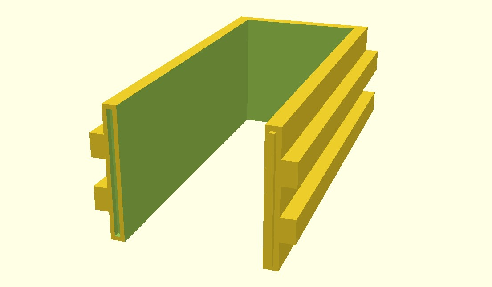
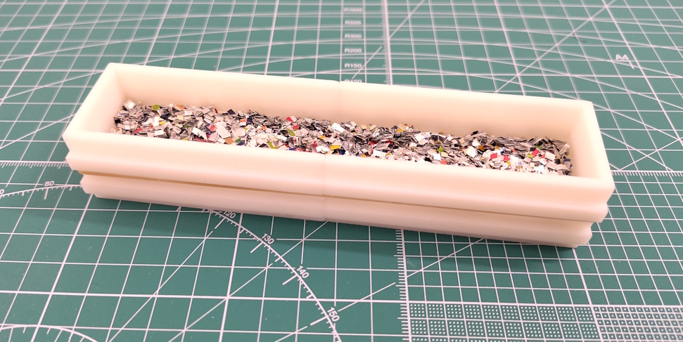

# EaosMold
## Description
This Repo contains a configurable 3D-printable mold for "cargo inserts" for 1:87 open wagons/gondolas like the Eas/Eaos/Eanos/Fas wagons used by a varietiy of european railway companies.

It's designed for the "foam+glue+material" method for modeling cargo loads without getting glue near the models.
[See a Youtube video by marklinofsweden for the general approach](https://youtu.be/UX1iH83uxw8?t=262&si=5sJGWLDHr9RA0Jd2).

The mold is designed as two identical parts that are secured with rubber bands. I've used a commerical 3d printing service to print it using SLA technology to try and get a somewhat smooth surface finish. I have not tested it with FDM printers.
I've paid USD 5.17 not including shipping for manufacturing two pieces with the most economical resin from a chinese manufacturer.

*A render of the 3d model*

*A photo of the prototype with an attempt at scrap as cargo and imperfect lighting.*

## Other approaches I've seen

This was mostly for the fun of it and trying out a 3d printing service to get an object manufactured with better precision than I can achieve with a saw and some wood. Other approaches I've seen are:

- Accepting that the load will be glued to the wagon
- Using a plasitc foil to try preventing glue/IPA/Ethanol from reaching the wagon.
- Applying the glue and material to the styrofoam while just sitting outside the wagon.

## Difficulties and improvments

- The inital prototype was made with a 1mm space between each wall and the load. This was too loose, the load was not held in place and leaves a noticeable gap.
- The prototype wasn't made to any particular height. I've chosen to make it as high as wide to prevents spills, but found it hard to judge how high the load should be. A next version should be made to the height of the wagon's walls.
- The PVA glue ends up sticking to the mold.
I've been able to just take the mold apart slightly while the glue is still wet without disturbing the load.
I want to try polishing the mold or applying candle wax as a poor mans mold release agent.

- Text to tell slightly different molds apart.

- Modeling the top of the mold more like the actual wagon for fitting a cargo net or tarpaulin.
